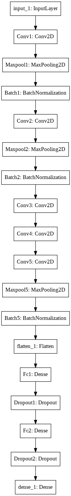
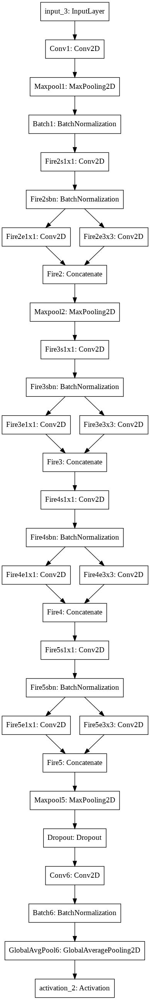

## Alexnet-SqueezeNet-Comparison-CIFAR10

AlexNet & SqueezeNet Comparison on CIFAR10 dataset

It is implemented as Keras on Google Colab (Tesla K80 GPU).  
AlexnNet and SqueezeNet is slightly changed to fit in CIFAR10 input image size (32 x 32).  
In this repo, SqueezeNet has less Fire layers than original SqueezeNet for comparing AlexNet.  
* * *
#### AlexNet 
Number of parameters: 22,559,626  
Test Accuracy: 79.28%  

#### SqueezeNet 
Number of parameters: 378,914  
Test Accuracy: 80.29%  
* * * 

### Models overview (left: AlexNet, right: SqueezeNet)

  
  

